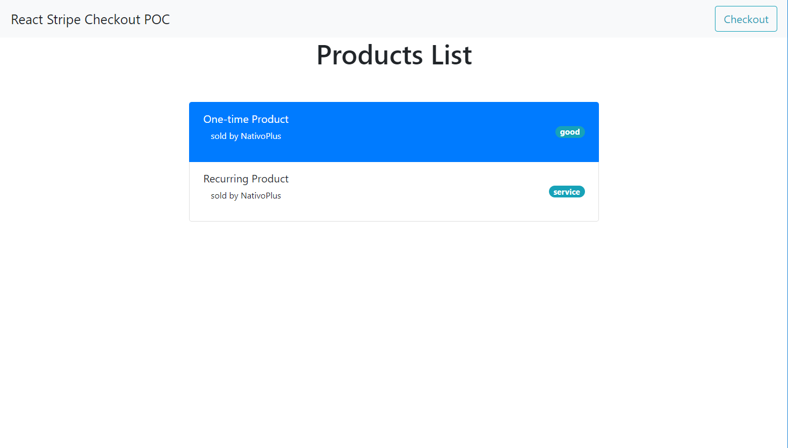
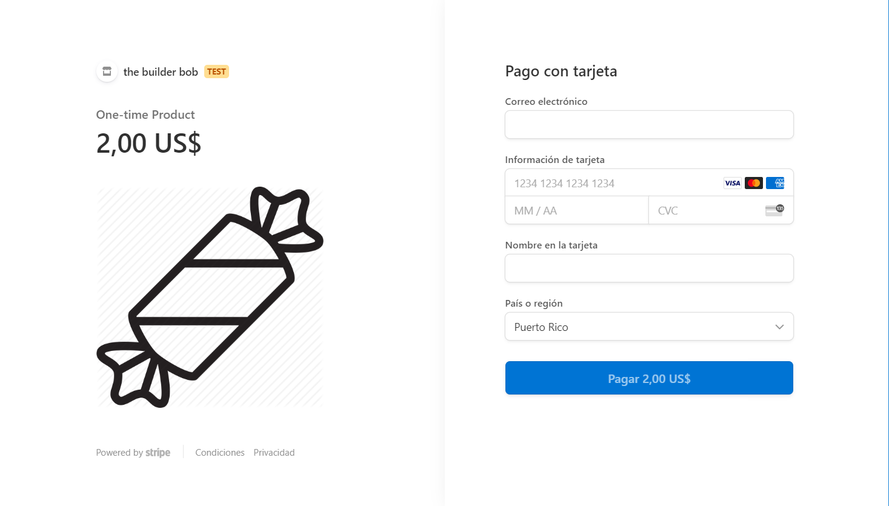

This project is a proof of concept that triggers the 3D Secure authentication challenge by using the [Stripe Checkout](https://stripe.com/docs/payments/checkout).

## Resources Used

Here are the resources used to create this web app:

### Stripe Elements library

This is located here: https://stripe.com/docs/recipes/elements-react

### GitHub repo `react-stripe-elements`

This is located here: https://github.com/stripe/react-stripe-elements

### Stripe.js Reference

This is located here: https://stripe.com/docs/stripe-js/reference

## Other Resources

### Supported Currencies

This is located here: https://stripe.com/docs/currencies

### How Stripe Handles Currency Conversions

This is located here: https://stripe.com/docs/currencies/conversions

## User Interface Preview

Here are some screenshots of the web app:

